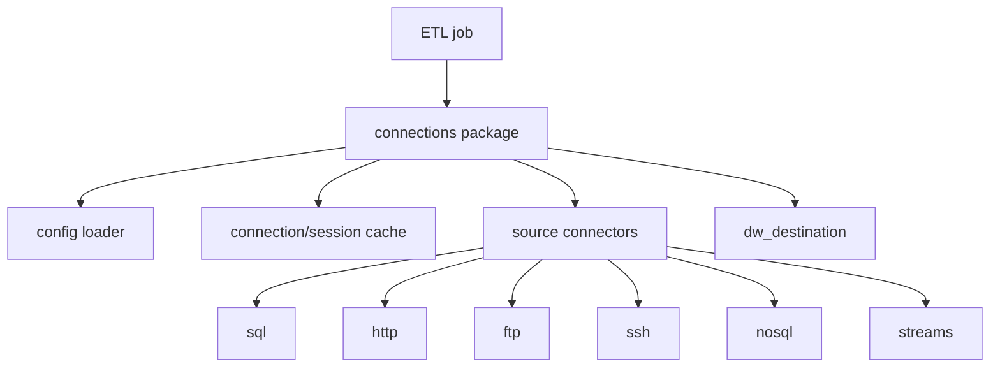
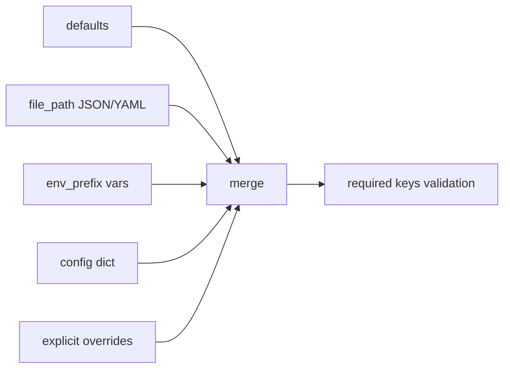
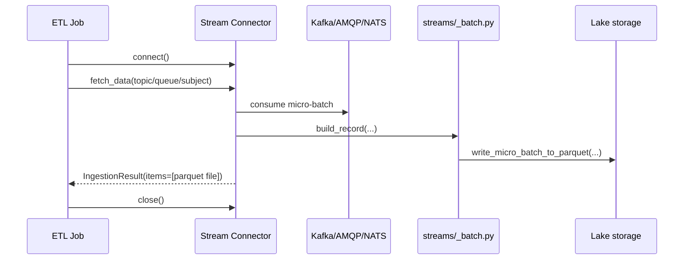

# Connections Package Guide

This guide explains the purpose of every module under `etl/connections`, how configuration is resolved, and how to use each connector pattern in day-to-day ETL development.

## What this package does

- Centralizes connection setup for SQL, NoSQL, REST, file transfer, and stream sources.
- Provides reusable caches for expensive connection objects (SQLAlchemy engines, HTTP sessions, and some driver sessions).
- Standardizes connector behavior via a common interface (`connect`, `fetch_data`, `close`).
- Supports layered configuration from defaults, files, environment variables, and runtime overrides.

## High-level architecture



## Folder map and responsibilities

### Package root (`etl/connections`)

- `__init__.py`  
  Public façade. Exposes helpers such as `get_connection`, `test_connection`, and direct connector builders.
- `_config.py`  
  Shared config loader with merge precedence and required key validation.
- `_engine_cache.py`  
  Thread-safe SQLAlchemy engine cache.
- `_session_cache.py`  
  Thread-safe session cache (thread-aware for HTTP sessions, reused by some NoSQL/driver clients).
- `_logging.py`  
  Default logger setup and sensitive field redaction.
- `dw_destination.py`  
  Dedicated PostgreSQL Data Warehouse destination engine and health check.

### Sources (`etl/connections/sources`)

- `base_connector.py`  
  Abstract connector contract.
- `data_contract.py`  
  Pydantic result models (`IngestedItem`, `IngestionResult`).
- `factory.py`  
  Dynamic connector creation from config (`protocol`-driven discovery).

### Protocol subpackages

- `sql/`: SQL engines and incremental extraction helper.
- `http/`: REST session helpers and HTTP connector class.
- `ftp/`: FTP download connector.
- `ssh/`: SFTP download connector over SSH.
- `nosql/`: Cassandra sessions and Neo4j drivers.
- `streams/`: Kafka/AMQP/NATS micro-batch ingestion to Parquet in lake storage.

## Configuration model and precedence

All connector builders rely on `load_connection_config`.



Merge order (left to right) means later layers override earlier values:

1. `defaults`
2. config file (`file_path`)
3. environment values (`<PREFIX>_*`)
4. direct `config` dict
5. explicit `overrides` (function arguments)

Example:

- `env_prefix="PG"` expects variables such as `PG_HOST`, `PG_DATABASE`, `PG_USERNAME`, `PG_PASSWORD`.

## Connection lifecycle patterns

### Pattern A: Direct helper functions

Use for scripts that only need a client/engine quickly.

```python
from connections import get_postgres_engine, test_postgres_connection

ok = test_postgres_connection(host="localhost", database="src", username="etl", password="secret")
if ok:
    engine = get_postgres_engine(host="localhost", database="src", username="etl", password="secret")
```

### Pattern B: Generic entrypoint

Use when protocol is dynamic.

```python
from connections import get_connection, test_connection

if test_connection("sqlite", database_path=":memory:"):
    engine = get_connection("sqlite", database_path=":memory:")
```

### Pattern C: Class-based connectors

Use for ingestion workflows that produce `IngestionResult`.

```python
from connections.sources.ftp.connector import FTPConnector

connector = FTPConnector(host="ftp.example.com", username="etl", password="secret")
connector.connect()
result = connector.fetch_data("/exports")
connector.close()
```

SOAP connector example:

```python
from connections.sources.http.soap_connector import SOAPConnector

connector = SOAPConnector(
  wsdl_url="https://example.com/service?wsdl",
  username="soap_user",
  password="soap_password",
)
connector.connect()
result = connector.fetch_data("GetOrders")
connector.close()
```

## Caching behavior

- SQL engines are cached by connection type + normalized config (see `_engine_cache.py`).
- HTTP sessions are cached by connection type + normalized config + current thread id (see `_session_cache.py`).
- Some non-HTTP clients reuse the same session cache helper; this keeps creation logic consistent.
- Set `reuse=False` when isolation is required.
- Use `close_all_connections()` to clear all cached resources.

## Streams ingestion flow



## Using the dynamic factory

`create_connector` discovers connector classes from `connections.sources` using the `protocol` field.

```python
from connections.sources.factory import create_connector

connector = create_connector(
    {
        "protocol": "http",
        "base_url": "https://api.example.com",
        "token": "secret",
    }
)
connector.connect()
result = connector.fetch_data("/health")
connector.close()
```

SOAP via protocol discovery:

```python
connector = create_connector(
  {
    "protocol": "soap",
    "wsdl_url": "https://example.com/service?wsdl",
    "username": "soap_user",
    "password": "soap_password",
  }
)
connector.connect()
result = connector.fetch_data("GetOrders")
connector.close()
```

Ready-to-use config file examples:

- `etl/connections/examples/http_connector.example.json`
- `etl/connections/examples/http_connector.example.yaml`
- `etl/connections/examples/soap_connector.example.json`
- `etl/connections/examples/soap_connector.example.yaml`
- `etl/connections/examples/ftp_connector.example.json`
- `etl/connections/examples/ftp_connector.example.yaml`
- `etl/connections/examples/webdav_connector.example.json`
- `etl/connections/examples/webdav_connector.example.yaml`
- `etl/connections/examples/ssh_connector.example.json`
- `etl/connections/examples/ssh_connector.example.yaml`
- `etl/connections/examples/mongodb_connector.example.json`
- `etl/connections/examples/mongodb_connector.example.yaml`
- `etl/connections/examples/gsheets_connector.example.json`
- `etl/connections/examples/gsheets_connector.example.yaml`
- `etl/connections/examples/kafka_connector.example.json`
- `etl/connections/examples/kafka_connector.example.yaml`
- `etl/connections/examples/amqp_connector.example.json`
- `etl/connections/examples/amqp_connector.example.yaml`
- `etl/connections/examples/nats_connector.example.json`
- `etl/connections/examples/nats_connector.example.yaml`
- `etl/connections/examples/sqlite_connector.example.json`
- `etl/connections/examples/sqlite_connector.example.yaml`
- `etl/connections/examples/postgres_connector.example.json`
- `etl/connections/examples/postgres_connector.example.yaml`
- `etl/connections/examples/mssql_connector.example.json`
- `etl/connections/examples/mssql_connector.example.yaml`
- `etl/connections/examples/oracle_connector.example.json`
- `etl/connections/examples/oracle_connector.example.yaml`
- `etl/connections/examples/newprotocol_connector.example.json`
- `etl/connections/examples/newprotocol_connector.example.yaml`

### Where to put credentials

- Keep real credentials out of `*.example.*` files (they are templates only).
- Prefer environment variables with connector-specific prefixes:
  - Postgres: `PG_HOST`, `PG_DATABASE`, `PG_USERNAME`, `PG_PASSWORD`
  - MSSQL: `MSSQL_HOST`, `MSSQL_DATABASE`, `MSSQL_USERNAME`, `MSSQL_PASSWORD`
  - Oracle: `ORACLE_HOST`, `ORACLE_SERVICE_NAME`, `ORACLE_USERNAME`, `ORACLE_PASSWORD`
  - SQLite: `SQLITE_DATABASE_PATH`
- If using a config file, create your own local file (for example `etl/connections/examples/postgres.local.json`) and never commit it.
- Resolution order is: defaults → file → env vars → runtime config dict → explicit function args.

Config files are supported:

- JSON (`.json`)
- YAML (`.yaml`/`.yml`, requires `PyYAML`)

## Module-by-module quick reference

- `sources/sql/incremental.py`: incremental extraction by watermark with deterministic ordering.
- `sources/http/rest.py`: REST session creation and request helper (`request_rest`).
- `sources/http/connector.py`: class implementation returning `IngestionResult`.
- `sources/http/soap_connector.py`: SOAP client connector using Zeep with optional HTTP basic auth.
- `sources/ftp/connector.py`: downloads files with FTP `nlst` + `retrbinary`.
- `sources/ssh/connector.py`: downloads files through SFTP.
- `sources/nosql/cassandra.py`: Cassandra native session creation + health check.
- `sources/nosql/neo4j.py`: Neo4j Bolt driver creation + health check.
- `sources/streams/*.py`: micro-batch consumers with Parquet output.

## Recommended developer workflow

From `single_node_dw` root:

```bash
uv sync
uv run pytest tests/test_connections.py
```

If you update connector behavior, rerun this test module first because it covers:

- config merge behavior
- cache semantics
- URL/builders for SQL connectors
- health check behavior
- dynamic factory behavior
- connector lifecycle for protocol classes

## How to add a new connector

1. Create a new module under `sources/<protocol>/`.
2. Define config model in `config.py` (Pydantic).
3. Implement a connector that extends `BaseConnector`.
4. Follow method contract:
   - `connect()` initializes resources.
   - `fetch_data(query)` returns `IngestionResult`.
   - `close()` releases resources.
5. Export in package `__init__.py`.
6. Add/extend tests in `tests/test_connections.py`.

## Common pitfalls

- Missing required keys in config: check `required=(...)` used by each connector.
- Wrong env prefix: verify variables use `<PREFIX>_KEY` naming.
- Reuse confusion: pass `reuse=False` if you need fresh resources per call.
- Streams dependencies missing: install protocol-specific libraries (`confluent-kafka`, `pika`, `nats-py`).
